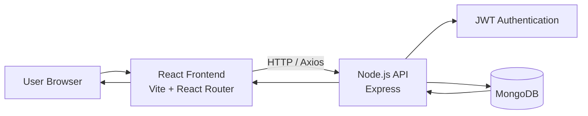

# SpendWise – Personal Finance Tracker

[](https://nodejs.org/)
[](https://react.dev/)
[](https://mongodb.com/)
[](License)

SpendWise is a full-stack personal finance tracking application built with **Node.js, Express, MongoDB, and React**.  

The application allows users to manage financial accounts, track income and expenses, transfer funds between accounts, and analyze spending patterns through interactive reports and charts.

---

# Features

### Authentication
- User registration and login
- JWT-based authentication
- Secure password hashing using bcrypt
- Protected routes in the frontend

### Accounts
- Create, edit, and delete financial accounts
- Multiple account types:
  - debit
  - credit
  - savings
  - investment
- Currency support per account
- Automatic balance calculations

### Transactions
- Record **income and expense transactions**
- Transfer money between accounts
- Transaction categories
- Transaction history
- Edit and delete transactions

### Dashboard
- Current balances across accounts
- Total income
- Total expenses
- Recent transactions overview

### Reports & Analytics
- Expenses by category (pie chart)
- Monthly expense trends (line chart)
- Income vs expenses comparison (bar chart)
- Filters by:
  - date range
  - account

### Developer Tools
- RESTful API
- Input validation with Zod
- Database seed script for demo data
- Secure API middleware

---

# Architecture



# Tech Stack

### Backend
- Node.js
- Express
- MongoDB
- Mongoose
- JWT Authentication
- Zod validation
- bcrypt password hashing

### Frontend
- React
- Vite
- React Router
- Axios
- Recharts (for reports and charts)

### Other Tools
- ESLint
- Prettier
- dotenv
- Postman (API testing)

# Project Structure

```
spend-wise-finance-tracker-2
│
├── backend
│   ├── src
│   │   ├── controllers
│   │   ├── models
│   │   ├── routes
│   │   ├── middleware
│   │   ├── validators
│   │   ├── constants
│   │   ├── config
│   │   └── scripts
│   │       └── seed.js
│   └── package.json
│
├── frontend
│   ├── src
│   │   ├── pages
│   │   ├── components
│   │   ├── context
│   │   ├── hooks
│   │   ├── api
│   │   └── styles
│   └── package.json
```

# Installation
### 1. Clone the repository
```
git clone https://github.com/yourusername/spend-wise-finance-tracker.git
cd spend-wise-finance-tracker
```
### 2. Setup Backend
```
cd backend
npm install
```
Create .env file:
```
PORT=5001
MONGO_URI=your_mongodb_connection_string
JWT_SECRET=your_secret
JWT_EXPIRES_IN=1d
CLIENT_URL=http://localhost:5173
```
Run backend:
```
npm run dev
```
### 3. Setup Frontend
```
cd frontend
npm install
```
Create .env file:
```
VITE_API_URL=http://localhost:5001/api
```
Run frontend:
```
npm run dev
```
# Database Seed (Demo Data)
Populate the database with demo accounts and transactions.
```
cd backend
npm run seed
```
Demo user credentials:
```
email: bill@spendwise.com
password: secret4321
```
# API Endpoints
### Authentication
```
POST /api/auth/register
POST /api/auth/login
```
### Accounts
```
GET    /api/accounts
POST   /api/accounts
GET    /api/accounts/:id
PATCH  /api/accounts/:id
DELETE /api/accounts/:id
GET    /api/accounts/:id/summary
```
### Transactions
```
GET    /api/transactions
POST   /api/transactions
GET    /api/transactions/:id
PATCH  /api/transactions/:id
DELETE /api/transactions/:id
```
### Reports
```
GET /api/reports/expenses-by-category
GET /api/reports/monthly-expenses-trend
GET /api/reports/income-vs-expenses
```
# Screenshots

# Future Improvements
- Budget tracking
- Recurring transactions
- Multi-currency support
- Export reports (CSV / PDF)
- Dark mode
- Mobile responsive UI improvements

# License

MIT License

# Author

Olesia Mironenko

GitHub:
https://github.com/olesiamironenko